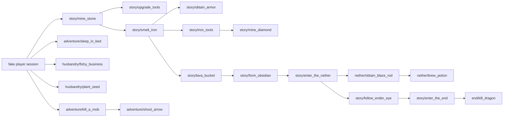
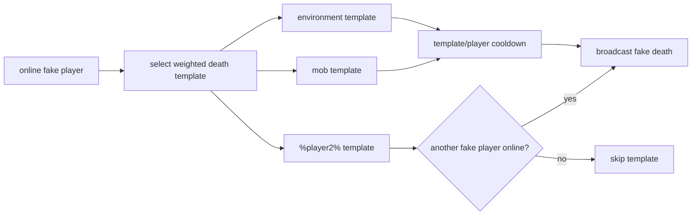
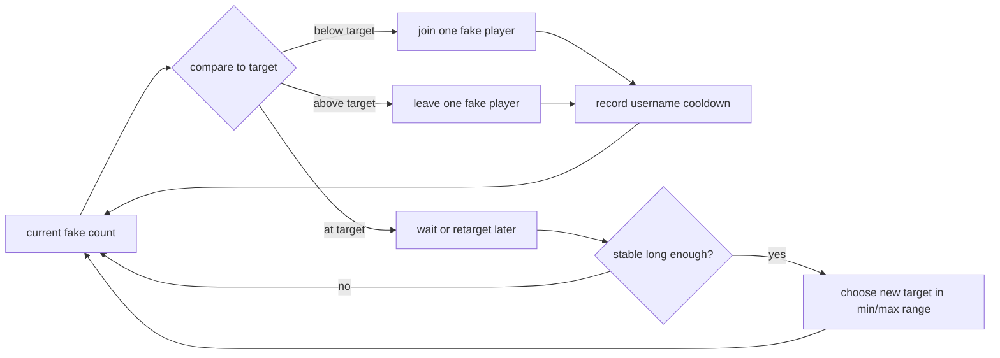
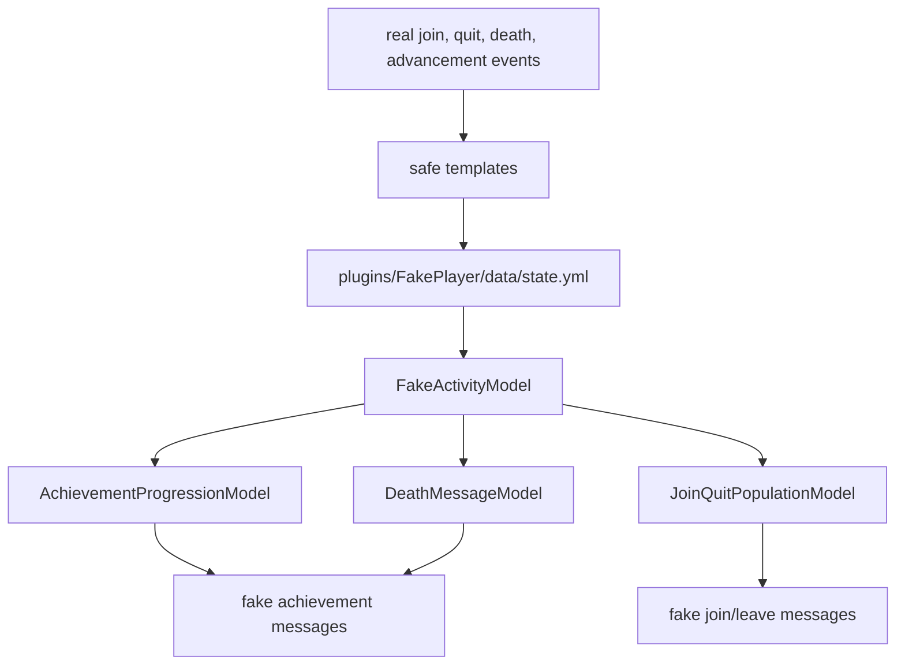

# Fake Activity Models

These models are intentionally soft. They guide random choices toward realistic outcomes without hardcoding one
play style, one time of day pattern, or one forced player path.

## Model Summary

| Feature | Runtime model | Learned data used |
| --- | --- | --- |
| Achievements | Soft progression graph + weighted frequency + per-player memory | Achievement message templates and timing samples |
| Deaths/kills | Weighted templates + validity filters + cooldown/history | Death message templates and timing samples |
| Join/leave | Population drift + interval histogram + username cooldown | Join/quit timing samples and captured player profiles |
| Usernames | Available-profile pool + recent-use cooldown | Captured join/quit profile data |

## Achievement Progression

The achievement graph is a probability shape, not a strict route. A fake player is more likely to get
achievements that fit its current progress and known prerequisites, but common server achievements can still win.



Runtime scoring:

```text
achievement weight =
  server-observed message count
  * novelty for this fake player
  * soft prerequisite/progression score
  * small random variation
```

Stored per fake player:

```text
achievement-score
shown-achievements
shown-achievement-keys
last-achievement-millis
```

## Death/Kill Messages

Deaths do not need a prerequisite graph. They need context validity and repetition control.



Runtime scoring:

```text
death weight =
  server-observed template count
  * recent-template penalty
  * victim cooldown penalty
  * second-player validity score
```

## Join/Leave Population Drift

Join/leave messages are controlled by a target population model. The plugin picks a target inside the configured
range and moves toward it one join/leave event at a time.



Runtime scoring:

```text
join/leave action =
  configured min/max fake player range
  + learned join/quit interval timing
  + current fake count
  + stable target count
  + available username profiles
```

Username cooldown is a preference. If every available profile is on cooldown, the plugin still falls back to the
available pool so sparse data does not stop fake activity.

## Data Flow


